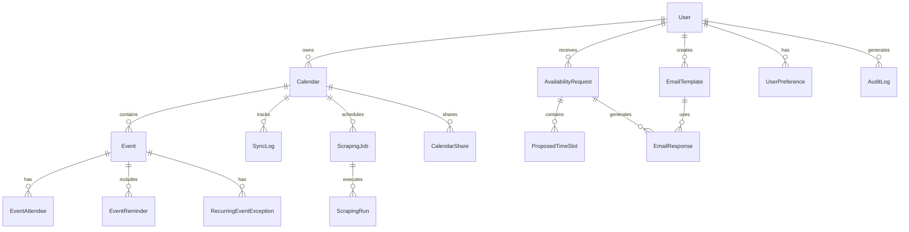

# Calendar Availability Management System - Database Schema

**Version**: 1.0.0
**Created**: 2025-11-18
**Database**: PostgreSQL 15+

## Schema Overview

The database schema is designed with the following principles:
- **Normalization**: 3NF to prevent data anomalies
- **Performance**: Strategic indexing and partitioning
- **Scalability**: UUID primary keys, timestamp-based partitioning
- **Audit Trail**: Created/updated timestamps on all tables
- **Soft Deletes**: Deleted_at columns for data recovery
- **Time Zones**: All timestamps stored in UTC
- **JSONB**: Flexible storage for varying data structures

---

## Entity Relationship Diagram



---

## Core Tables

### users
Primary user account table.

```sql
CREATE TABLE users (
    id UUID PRIMARY KEY DEFAULT gen_random_uuid(),
    email VARCHAR(255) NOT NULL UNIQUE,
    password_hash VARCHAR(255),
    name VARCHAR(255),
    timezone VARCHAR(50) NOT NULL DEFAULT 'UTC',
    locale VARCHAR(10) DEFAULT 'en-US',
    avatar_url TEXT,
    email_verified BOOLEAN DEFAULT FALSE,
    email_verified_at TIMESTAMP,
    is_active BOOLEAN DEFAULT TRUE,
    last_login_at TIMESTAMP,
    created_at TIMESTAMP NOT NULL DEFAULT CURRENT_TIMESTAMP,
    updated_at TIMESTAMP NOT NULL DEFAULT CURRENT_TIMESTAMP,
    deleted_at TIMESTAMP,
    CONSTRAINT email_format CHECK (email ~* '^[A-Za-z0-9._%+-]+@[A-Za-z0-9.-]+\.[A-Z]{2,}$')
);

CREATE INDEX idx_users_email ON users(email) WHERE deleted_at IS NULL;
CREATE INDEX idx_users_active ON users(is_active) WHERE deleted_at IS NULL;
CREATE INDEX idx_users_created_at ON users(created_at DESC);
```

### user_preferences
User-specific settings and preferences.

```sql
CREATE TABLE user_preferences (
    id UUID PRIMARY KEY DEFAULT gen_random_uuid(),
    user_id UUID NOT NULL REFERENCES users(id) ON DELETE CASCADE,
    working_hours JSONB DEFAULT '{
        "monday": {"start": "09:00", "end": "17:00"},
        "tuesday": {"start": "09:00", "end": "17:00"},
        "wednesday": {"start": "09:00", "end": "17:00"},
        "thursday": {"start": "09:00", "end": "17:00"},
        "friday": {"start": "09:00", "end": "17:00"}
    }',
    buffer_time INTEGER DEFAULT 15, -- minutes
    default_meeting_duration INTEGER DEFAULT 60, -- minutes
    auto_respond BOOLEAN DEFAULT FALSE,
    auto_respond_delay INTEGER DEFAULT 300, -- seconds
    notification_preferences JSONB DEFAULT '{
        "email": true,
        "push": false,
        "sms": false
    }',
    scheduling_preferences JSONB DEFAULT '{
        "avoid_back_to_back": true,
        "prefer_video_calls": false,
        "minimum_notice": 1440
    }',
    created_at TIMESTAMP NOT NULL DEFAULT CURRENT_TIMESTAMP,
    updated_at TIMESTAMP NOT NULL DEFAULT CURRENT_TIMESTAMP,
    UNIQUE(user_id)
);

CREATE INDEX idx_user_preferences_user_id ON user_preferences(user_id);
```

### oauth_tokens
OAuth token storage for external service authentication.

```sql
CREATE TABLE oauth_tokens (
    id UUID PRIMARY KEY DEFAULT gen_random_uuid(),
    user_id UUID NOT NULL REFERENCES users(id) ON DELETE CASCADE,
    provider VARCHAR(50) NOT NULL, -- 'google', 'microsoft', etc.
    access_token TEXT NOT NULL,
    refresh_token TEXT,
    token_type VARCHAR(50) DEFAULT 'Bearer',
    scope TEXT,
    expires_at TIMESTAMP,
    raw_response JSONB,
    created_at TIMESTAMP NOT NULL DEFAULT CURRENT_TIMESTAMP,
    updated_at TIMESTAMP NOT NULL DEFAULT CURRENT_TIMESTAMP,
    CONSTRAINT unique_user_provider UNIQUE(user_id, provider)
);

CREATE INDEX idx_oauth_tokens_user_provider ON oauth_tokens(user_id, provider);
CREATE INDEX idx_oauth_tokens_expires_at ON oauth_tokens(expires_at);
```

---

## Calendar Tables

### calendars
Calendar sources connected to the system.

```sql
CREATE TABLE calendars (
    id UUID PRIMARY KEY DEFAULT gen_random_uuid(),
    user_id UUID NOT NULL REFERENCES users(id) ON DELETE CASCADE,
    external_id VARCHAR(255), -- Google Calendar ID, etc.
    type VARCHAR(50) NOT NULL, -- 'google', 'outlook', 'external'
    name VARCHAR(255) NOT NULL,
    email VARCHAR(255),
    description TEXT,
    color VARCHAR(7) DEFAULT '#4285F4',
    is_primary BOOLEAN DEFAULT FALSE,
    sync_enabled BOOLEAN DEFAULT TRUE,
    visibility VARCHAR(20) DEFAULT 'private', -- 'private', 'public', 'shared'
    connection_status VARCHAR(20) DEFAULT 'connected', -- 'connected', 'error', 'disconnected'
    connection_metadata JSONB, -- Store provider-specific data
    last_sync_at TIMESTAMP,
    last_sync_token TEXT, -- For incremental sync
    sync_frequency INTEGER DEFAULT 300, -- seconds
    created_at TIMESTAMP NOT NULL DEFAULT CURRENT_TIMESTAMP,
    updated_at TIMESTAMP NOT NULL DEFAULT CURRENT_TIMESTAMP,
    deleted_at TIMESTAMP,
    CONSTRAINT one_primary_per_user UNIQUE(user_id, is_primary) WHERE is_primary = TRUE
);

CREATE INDEX idx_calendars_user_id ON calendars(user_id) WHERE deleted_at IS NULL;
CREATE INDEX idx_calendars_type ON calendars(type);
CREATE INDEX idx_calendars_sync_enabled ON calendars(sync_enabled) WHERE deleted_at IS NULL;
CREATE INDEX idx_calendars_last_sync ON calendars(last_sync_at);
```

### calendar_shares
Calendar sharing between users.

```sql
CREATE TABLE calendar_shares (
    id UUID PRIMARY KEY DEFAULT gen_random_uuid(),
    calendar_id UUID NOT NULL REFERENCES calendars(id) ON DELETE CASCADE,
    shared_with_user_id UUID NOT NULL REFERENCES users(id) ON DELETE CASCADE,
    permission VARCHAR(20) NOT NULL DEFAULT 'read', -- 'read', 'write'
    shared_by_user_id UUID NOT NULL REFERENCES users(id),
    accepted BOOLEAN DEFAULT FALSE,
    accepted_at TIMESTAMP,
    expires_at TIMESTAMP,
    created_at TIMESTAMP NOT NULL DEFAULT CURRENT_TIMESTAMP,
    CONSTRAINT unique_calendar_share UNIQUE(calendar_id, shared_with_user_id)
);

CREATE INDEX idx_calendar_shares_calendar ON calendar_shares(calendar_id);
CREATE INDEX idx_calendar_shares_user ON calendar_shares(shared_with_user_id);
CREATE INDEX idx_calendar_shares_accepted ON calendar_shares(accepted);
```

---

## Event Tables

### events
Calendar events from all sources.

```sql
CREATE TABLE events (
    id UUID PRIMARY KEY DEFAULT gen_random_uuid(),
    calendar_id UUID NOT NULL REFERENCES calendars(id) ON DELETE CASCADE,
    external_id VARCHAR(255), -- Provider's event ID
    title VARCHAR(500) NOT NULL,
    description TEXT,
    location TEXT,
    start_time TIMESTAMP NOT NULL,
    end_time TIMESTAMP NOT NULL,
    all_day BOOLEAN DEFAULT FALSE,
    status VARCHAR(20) DEFAULT 'confirmed', -- 'confirmed', 'tentative', 'cancelled'
    visibility VARCHAR(20) DEFAULT 'default', -- 'default', 'public', 'private', 'confidential'
    busy_status VARCHAR(20) DEFAULT 'busy', -- 'busy', 'free', 'tentative'
    color VARCHAR(7),
    conference_data JSONB, -- Video call links, phone numbers
    attachments JSONB, -- File attachments
    recurring_event_id UUID, -- Reference to parent recurring event
    original_start_time TIMESTAMP, -- For recurring event instances
    is_recurring BOOLEAN DEFAULT FALSE,
    recurrence_rule JSONB, -- RRULE data
    organizer_email VARCHAR(255),
    organizer_name VARCHAR(255),
    html_link TEXT, -- Link to event in source calendar
    etag VARCHAR(255), -- For change detection
    created_at TIMESTAMP NOT NULL DEFAULT CURRENT_TIMESTAMP,
    updated_at TIMESTAMP NOT NULL DEFAULT CURRENT_TIMESTAMP,
    deleted_at TIMESTAMP,
    CONSTRAINT unique_external_event UNIQUE(calendar_id, external_id),
    CONSTRAINT valid_time_range CHECK (end_time > start_time)
);

-- Partitioned by month for performance
CREATE INDEX idx_events_calendar_id ON events(calendar_id) WHERE deleted_at IS NULL;
CREATE INDEX idx_events_start_time ON events(start_time) WHERE deleted_at IS NULL;
CREATE INDEX idx_events_end_time ON events(end_time) WHERE deleted_at IS NULL;
CREATE INDEX idx_events_recurring ON events(recurring_event_id) WHERE recurring_event_id IS NOT NULL;
CREATE INDEX idx_events_status ON events(status);
CREATE INDEX idx_events_time_range ON events(start_time, end_time) WHERE deleted_at IS NULL;
```

### event_attendees
Event participants and their response status.

```sql
CREATE TABLE event_attendees (
    id UUID PRIMARY KEY DEFAULT gen_random_uuid(),
    event_id UUID NOT NULL REFERENCES events(id) ON DELETE CASCADE,
    email VARCHAR(255) NOT NULL,
    name VARCHAR(255),
    response_status VARCHAR(20) DEFAULT 'needsAction', -- 'accepted', 'declined', 'tentative', 'needsAction'
    is_optional BOOLEAN DEFAULT FALSE,
    is_organizer BOOLEAN DEFAULT FALSE,
    comment TEXT,
    additional_guests INTEGER DEFAULT 0,
    created_at TIMESTAMP NOT NULL DEFAULT CURRENT_TIMESTAMP,
    updated_at TIMESTAMP NOT NULL DEFAULT CURRENT_TIMESTAMP,
    CONSTRAINT unique_event_attendee UNIQUE(event_id, email)
);

CREATE INDEX idx_event_attendees_event ON event_attendees(event_id);
CREATE INDEX idx_event_attendees_email ON event_attendees(email);
CREATE INDEX idx_event_attendees_response ON event_attendees(response_status);
```

### event_reminders
Reminders/notifications for events.

```sql
CREATE TABLE event_reminders (
    id UUID PRIMARY KEY DEFAULT gen_random_uuid(),
    event_id UUID NOT NULL REFERENCES events(id) ON DELETE CASCADE,
    method VARCHAR(20) NOT NULL, -- 'email', 'popup', 'sms'
    minutes_before INTEGER NOT NULL, -- Minutes before event
    created_at TIMESTAMP NOT NULL DEFAULT CURRENT_TIMESTAMP
);

CREATE INDEX idx_event_reminders_event ON event_reminders(event_id);
```

### recurring_event_exceptions
Modifications to specific instances of recurring events.

```sql
CREATE TABLE recurring_event_exceptions (
    id UUID PRIMARY KEY DEFAULT gen_random_uuid(),
    recurring_event_id UUID NOT NULL REFERENCES events(id) ON DELETE CASCADE,
    original_start_time TIMESTAMP NOT NULL,
    is_cancelled BOOLEAN DEFAULT FALSE,
    modified_event_id UUID REFERENCES events(id) ON DELETE SET NULL,
    created_at TIMESTAMP NOT NULL DEFAULT CURRENT_TIMESTAMP,
    CONSTRAINT unique_exception UNIQUE(recurring_event_id, original_start_time)
);

CREATE INDEX idx_recurring_exceptions_event ON recurring_event_exceptions(recurring_event_id);
```

---

## Email Tables

### email_templates
User-defined email templates for responses.

```sql
CREATE TABLE email_templates (
    id UUID PRIMARY KEY DEFAULT gen_random_uuid(),
    user_id UUID NOT NULL REFERENCES users(id) ON DELETE CASCADE,
    name VARCHAR(255) NOT NULL,
    type VARCHAR(50) NOT NULL, -- 'availability', 'confirmation', 'decline', 'reschedule'
    subject VARCHAR(500) NOT NULL,
    body TEXT NOT NULL,
    variables JSONB, -- List of available variables
    is_default BOOLEAN DEFAULT FALSE,
    is_active BOOLEAN DEFAULT TRUE,
    language VARCHAR(10) DEFAULT 'en',
    usage_count INTEGER DEFAULT 0,
    created_at TIMESTAMP NOT NULL DEFAULT CURRENT_TIMESTAMP,
    updated_at TIMESTAMP NOT NULL DEFAULT CURRENT_TIMESTAMP,
    deleted_at TIMESTAMP,
    CONSTRAINT unique_default_template UNIQUE(user_id, type, is_default) WHERE is_default = TRUE
);

CREATE INDEX idx_email_templates_user ON email_templates(user_id) WHERE deleted_at IS NULL;
CREATE INDEX idx_email_templates_type ON email_templates(type);
CREATE INDEX idx_email_templates_default ON email_templates(user_id, type, is_default);
```

### availability_requests
Incoming availability/scheduling requests via email.

```sql
CREATE TABLE availability_requests (
    id UUID PRIMARY KEY DEFAULT gen_random_uuid(),
    user_id UUID NOT NULL REFERENCES users(id) ON DELETE CASCADE,
    email_message_id VARCHAR(255) UNIQUE,
    thread_id VARCHAR(255),
    from_email VARCHAR(255) NOT NULL,
    from_name VARCHAR(255),
    subject TEXT,
    body TEXT,
    parsed_data JSONB, -- NLP extracted data
    status VARCHAR(20) DEFAULT 'pending', -- 'pending', 'processing', 'responded', 'scheduled', 'declined'
    priority VARCHAR(20) DEFAULT 'normal', -- 'low', 'normal', 'high', 'urgent'
    detected_intent VARCHAR(50), -- 'schedule', 'reschedule', 'cancel', 'availability_check'
    confidence_score DECIMAL(3,2), -- 0.00 to 1.00
    auto_respond BOOLEAN DEFAULT FALSE,
    responded_at TIMESTAMP,
    scheduled_event_id UUID REFERENCES events(id),
    created_at TIMESTAMP NOT NULL DEFAULT CURRENT_TIMESTAMP,
    updated_at TIMESTAMP NOT NULL DEFAULT CURRENT_TIMESTAMP
);

CREATE INDEX idx_availability_requests_user ON availability_requests(user_id);
CREATE INDEX idx_availability_requests_status ON availability_requests(status);
CREATE INDEX idx_availability_requests_created ON availability_requests(created_at DESC);
CREATE INDEX idx_availability_requests_thread ON availability_requests(thread_id);
```

### proposed_time_slots
Time slots proposed in availability requests.

```sql
CREATE TABLE proposed_time_slots (
    id UUID PRIMARY KEY DEFAULT gen_random_uuid(),
    request_id UUID NOT NULL REFERENCES availability_requests(id) ON DELETE CASCADE,
    start_time TIMESTAMP NOT NULL,
    end_time TIMESTAMP NOT NULL,
    timezone VARCHAR(50) DEFAULT 'UTC',
    is_flexible BOOLEAN DEFAULT FALSE,
    preference_rank INTEGER, -- 1 = most preferred
    created_at TIMESTAMP NOT NULL DEFAULT CURRENT_TIMESTAMP
);

CREATE INDEX idx_proposed_slots_request ON proposed_time_slots(request_id);
CREATE INDEX idx_proposed_slots_time ON proposed_time_slots(start_time, end_time);
```

### email_responses
Sent email responses to availability requests.

```sql
CREATE TABLE email_responses (
    id UUID PRIMARY KEY DEFAULT gen_random_uuid(),
    request_id UUID NOT NULL REFERENCES availability_requests(id) ON DELETE CASCADE,
    template_id UUID REFERENCES email_templates(id),
    message_id VARCHAR(255),
    to_email VARCHAR(255) NOT NULL,
    cc_emails TEXT[], -- Array of CC recipients
    subject TEXT NOT NULL,
    body TEXT NOT NULL,
    suggested_slots JSONB, -- Array of suggested time slots
    action_taken VARCHAR(50), -- 'suggested_times', 'accepted', 'declined', 'requested_more_info'
    sent_at TIMESTAMP,
    delivery_status VARCHAR(20) DEFAULT 'pending', -- 'pending', 'sent', 'delivered', 'bounced', 'failed'
    error_details TEXT,
    created_at TIMESTAMP NOT NULL DEFAULT CURRENT_TIMESTAMP
);

CREATE INDEX idx_email_responses_request ON email_responses(request_id);
CREATE INDEX idx_email_responses_sent ON email_responses(sent_at);
CREATE INDEX idx_email_responses_status ON email_responses(delivery_status);
```

---

## Scraping Tables

### scraping_jobs
Configuration for external calendar scraping jobs.

```sql
CREATE TABLE scraping_jobs (
    id UUID PRIMARY KEY DEFAULT gen_random_uuid(),
    calendar_id UUID NOT NULL REFERENCES calendars(id) ON DELETE CASCADE,
    url TEXT NOT NULL,
    auth_type VARCHAR(20) NOT NULL, -- 'basic', 'oauth', 'form', 'none'
    auth_config JSONB, -- Encrypted credentials
    selectors JSONB, -- CSS/XPath selectors for data extraction
    schedule_cron VARCHAR(100), -- Cron expression for scheduling
    is_active BOOLEAN DEFAULT TRUE,
    retry_count INTEGER DEFAULT 3,
    retry_delay INTEGER DEFAULT 60, -- seconds
    timeout INTEGER DEFAULT 30000, -- milliseconds
    last_successful_run TIMESTAMP,
    next_run_at TIMESTAMP,
    failure_count INTEGER DEFAULT 0,
    created_at TIMESTAMP NOT NULL DEFAULT CURRENT_TIMESTAMP,
    updated_at TIMESTAMP NOT NULL DEFAULT CURRENT_TIMESTAMP,
    UNIQUE(calendar_id)
);

CREATE INDEX idx_scraping_jobs_calendar ON scraping_jobs(calendar_id);
CREATE INDEX idx_scraping_jobs_active ON scraping_jobs(is_active);
CREATE INDEX idx_scraping_jobs_next_run ON scraping_jobs(next_run_at) WHERE is_active = TRUE;
```

### scraping_runs
History of scraping job executions.

```sql
CREATE TABLE scraping_runs (
    id UUID PRIMARY KEY DEFAULT gen_random_uuid(),
    job_id UUID NOT NULL REFERENCES scraping_jobs(id) ON DELETE CASCADE,
    status VARCHAR(20) NOT NULL, -- 'started', 'completed', 'failed', 'timeout'
    started_at TIMESTAMP NOT NULL,
    completed_at TIMESTAMP,
    duration INTEGER, -- milliseconds
    events_found INTEGER DEFAULT 0,
    events_created INTEGER DEFAULT 0,
    events_updated INTEGER DEFAULT 0,
    events_deleted INTEGER DEFAULT 0,
    error_message TEXT,
    error_stack TEXT,
    screenshot_url TEXT, -- For debugging failed runs
    raw_data JSONB, -- Extracted raw data
    created_at TIMESTAMP NOT NULL DEFAULT CURRENT_TIMESTAMP
);

CREATE INDEX idx_scraping_runs_job ON scraping_runs(job_id);
CREATE INDEX idx_scraping_runs_status ON scraping_runs(status);
CREATE INDEX idx_scraping_runs_created ON scraping_runs(created_at DESC);
```

---

## Analytics Tables

### availability_analyses
Computed availability patterns and insights.

```sql
CREATE TABLE availability_analyses (
    id UUID PRIMARY KEY DEFAULT gen_random_uuid(),
    user_id UUID NOT NULL REFERENCES users(id) ON DELETE CASCADE,
    analysis_period VARCHAR(20) NOT NULL, -- 'day', 'week', 'month', 'quarter'
    period_start DATE NOT NULL,
    period_end DATE NOT NULL,
    total_events INTEGER DEFAULT 0,
    total_meeting_time INTEGER DEFAULT 0, -- minutes
    average_meeting_duration INTEGER, -- minutes
    busiest_day VARCHAR(10), -- day of week
    busiest_hour INTEGER, -- 0-23
    most_frequent_attendees JSONB, -- Array of {email, count}
    availability_score DECIMAL(3,2), -- 0.00 to 1.00
    patterns JSONB, -- Detailed pattern analysis
    created_at TIMESTAMP NOT NULL DEFAULT CURRENT_TIMESTAMP,
    CONSTRAINT unique_analysis_period UNIQUE(user_id, analysis_period, period_start)
);

CREATE INDEX idx_availability_analyses_user ON availability_analyses(user_id);
CREATE INDEX idx_availability_analyses_period ON availability_analyses(period_start, period_end);
```

### usage_metrics
System usage tracking for analytics.

```sql
CREATE TABLE usage_metrics (
    id UUID PRIMARY KEY DEFAULT gen_random_uuid(),
    user_id UUID REFERENCES users(id) ON DELETE SET NULL,
    metric_type VARCHAR(50) NOT NULL, -- 'api_call', 'sync', 'email_sent', etc.
    metric_name VARCHAR(100) NOT NULL,
    metric_value DECIMAL,
    metadata JSONB,
    timestamp TIMESTAMP NOT NULL DEFAULT CURRENT_TIMESTAMP
);

-- Partitioned by month
CREATE INDEX idx_usage_metrics_user ON usage_metrics(user_id);
CREATE INDEX idx_usage_metrics_type ON usage_metrics(metric_type);
CREATE INDEX idx_usage_metrics_timestamp ON usage_metrics(timestamp DESC);
```

---

## System Tables

### sync_logs
Calendar synchronization history.

```sql
CREATE TABLE sync_logs (
    id UUID PRIMARY KEY DEFAULT gen_random_uuid(),
    calendar_id UUID NOT NULL REFERENCES calendars(id) ON DELETE CASCADE,
    sync_type VARCHAR(20) NOT NULL, -- 'full', 'incremental', 'webhook'
    status VARCHAR(20) NOT NULL, -- 'started', 'completed', 'failed'
    started_at TIMESTAMP NOT NULL,
    completed_at TIMESTAMP,
    events_processed INTEGER DEFAULT 0,
    events_created INTEGER DEFAULT 0,
    events_updated INTEGER DEFAULT 0,
    events_deleted INTEGER DEFAULT 0,
    sync_token TEXT, -- For incremental sync
    error_message TEXT,
    error_details JSONB,
    created_at TIMESTAMP NOT NULL DEFAULT CURRENT_TIMESTAMP
);

CREATE INDEX idx_sync_logs_calendar ON sync_logs(calendar_id);
CREATE INDEX idx_sync_logs_created ON sync_logs(created_at DESC);
CREATE INDEX idx_sync_logs_status ON sync_logs(status);
```

### webhook_subscriptions
Webhook subscriptions for calendar providers.

```sql
CREATE TABLE webhook_subscriptions (
    id UUID PRIMARY KEY DEFAULT gen_random_uuid(),
    calendar_id UUID NOT NULL REFERENCES calendars(id) ON DELETE CASCADE,
    provider VARCHAR(50) NOT NULL,
    webhook_url TEXT NOT NULL,
    channel_id VARCHAR(255) UNIQUE,
    resource_id VARCHAR(255),
    expiration TIMESTAMP,
    is_active BOOLEAN DEFAULT TRUE,
    created_at TIMESTAMP NOT NULL DEFAULT CURRENT_TIMESTAMP,
    updated_at TIMESTAMP NOT NULL DEFAULT CURRENT_TIMESTAMP,
    UNIQUE(calendar_id, provider)
);

CREATE INDEX idx_webhook_subscriptions_calendar ON webhook_subscriptions(calendar_id);
CREATE INDEX idx_webhook_subscriptions_expiration ON webhook_subscriptions(expiration);
```

### audit_logs
Comprehensive audit trail for compliance.

```sql
CREATE TABLE audit_logs (
    id UUID PRIMARY KEY DEFAULT gen_random_uuid(),
    user_id UUID REFERENCES users(id) ON DELETE SET NULL,
    action VARCHAR(100) NOT NULL,
    entity_type VARCHAR(50),
    entity_id UUID,
    old_values JSONB,
    new_values JSONB,
    ip_address INET,
    user_agent TEXT,
    metadata JSONB,
    created_at TIMESTAMP NOT NULL DEFAULT CURRENT_TIMESTAMP
);

-- Partitioned by month
CREATE INDEX idx_audit_logs_user ON audit_logs(user_id);
CREATE INDEX idx_audit_logs_entity ON audit_logs(entity_type, entity_id);
CREATE INDEX idx_audit_logs_created ON audit_logs(created_at DESC);
CREATE INDEX idx_audit_logs_action ON audit_logs(action);
```

### job_queue
Background job processing queue.

```sql
CREATE TABLE job_queue (
    id UUID PRIMARY KEY DEFAULT gen_random_uuid(),
    job_type VARCHAR(50) NOT NULL, -- 'sync', 'scrape', 'email', 'analysis'
    payload JSONB NOT NULL,
    priority INTEGER DEFAULT 0, -- Higher = more important
    status VARCHAR(20) DEFAULT 'pending', -- 'pending', 'processing', 'completed', 'failed'
    max_retries INTEGER DEFAULT 3,
    retry_count INTEGER DEFAULT 0,
    scheduled_for TIMESTAMP,
    started_at TIMESTAMP,
    completed_at TIMESTAMP,
    error_message TEXT,
    created_at TIMESTAMP NOT NULL DEFAULT CURRENT_TIMESTAMP,
    updated_at TIMESTAMP NOT NULL DEFAULT CURRENT_TIMESTAMP
);

CREATE INDEX idx_job_queue_status ON job_queue(status);
CREATE INDEX idx_job_queue_scheduled ON job_queue(scheduled_for) WHERE status = 'pending';
CREATE INDEX idx_job_queue_priority ON job_queue(priority DESC) WHERE status = 'pending';
```

---

## Functions and Triggers

### Updated Timestamp Trigger
Automatically update the updated_at column.

```sql
CREATE OR REPLACE FUNCTION update_updated_at()
RETURNS TRIGGER AS $$
BEGIN
    NEW.updated_at = CURRENT_TIMESTAMP;
    RETURN NEW;
END;
$$ LANGUAGE plpgsql;

-- Apply to all tables with updated_at column
CREATE TRIGGER update_users_updated_at BEFORE UPDATE ON users
    FOR EACH ROW EXECUTE FUNCTION update_updated_at();

CREATE TRIGGER update_calendars_updated_at BEFORE UPDATE ON calendars
    FOR EACH ROW EXECUTE FUNCTION update_updated_at();

-- ... (apply to all relevant tables)
```

### Soft Delete Function
Handle soft deletes across related tables.

```sql
CREATE OR REPLACE FUNCTION soft_delete_cascade()
RETURNS TRIGGER AS $$
BEGIN
    -- Soft delete related calendars when user is soft deleted
    IF TG_TABLE_NAME = 'users' THEN
        UPDATE calendars SET deleted_at = NEW.deleted_at
        WHERE user_id = NEW.id AND deleted_at IS NULL;

    -- Soft delete related events when calendar is soft deleted
    ELSIF TG_TABLE_NAME = 'calendars' THEN
        UPDATE events SET deleted_at = NEW.deleted_at
        WHERE calendar_id = NEW.id AND deleted_at IS NULL;
    END IF;

    RETURN NEW;
END;
$$ LANGUAGE plpgsql;

CREATE TRIGGER soft_delete_user_cascade AFTER UPDATE OF deleted_at ON users
    FOR EACH ROW WHEN (NEW.deleted_at IS NOT NULL AND OLD.deleted_at IS NULL)
    EXECUTE FUNCTION soft_delete_cascade();
```

### Availability Calculation Function
Calculate available time slots.

```sql
CREATE OR REPLACE FUNCTION calculate_availability(
    p_user_id UUID,
    p_start_time TIMESTAMP,
    p_end_time TIMESTAMP,
    p_duration INTEGER, -- minutes
    p_buffer_time INTEGER DEFAULT 0 -- minutes
)
RETURNS TABLE (
    slot_start TIMESTAMP,
    slot_end TIMESTAMP,
    is_available BOOLEAN
) AS $$
BEGIN
    -- Complex availability calculation logic
    -- Returns available time slots based on existing events
    RETURN QUERY
    WITH busy_times AS (
        SELECT
            start_time - (p_buffer_time || ' minutes')::INTERVAL as busy_start,
            end_time + (p_buffer_time || ' minutes')::INTERVAL as busy_end
        FROM events e
        JOIN calendars c ON e.calendar_id = c.id
        WHERE c.user_id = p_user_id
            AND c.sync_enabled = TRUE
            AND e.deleted_at IS NULL
            AND e.status != 'cancelled'
            AND e.busy_status = 'busy'
            AND e.end_time > p_start_time
            AND e.start_time < p_end_time
    ),
    time_slots AS (
        SELECT
            generate_series(
                p_start_time,
                p_end_time - (p_duration || ' minutes')::INTERVAL,
                '15 minutes'::INTERVAL
            ) as slot_start
    )
    SELECT
        ts.slot_start,
        ts.slot_start + (p_duration || ' minutes')::INTERVAL as slot_end,
        NOT EXISTS (
            SELECT 1 FROM busy_times bt
            WHERE bt.busy_start < ts.slot_start + (p_duration || ' minutes')::INTERVAL
                AND bt.busy_end > ts.slot_start
        ) as is_available
    FROM time_slots ts;
END;
$$ LANGUAGE plpgsql;
```

---

## Indexes Strategy

### Primary Indexes
- All primary keys (UUID) are automatically indexed
- Foreign keys have indexes for join performance

### Query Pattern Indexes
```sql
-- Multi-column indexes for common queries
CREATE INDEX idx_events_user_time ON events(calendar_id, start_time, end_time)
    WHERE deleted_at IS NULL;

CREATE INDEX idx_availability_requests_user_status ON availability_requests(user_id, status)
    WHERE status IN ('pending', 'processing');

-- Partial indexes for active records
CREATE INDEX idx_active_calendars ON calendars(user_id)
    WHERE deleted_at IS NULL AND sync_enabled = TRUE;

-- GIN indexes for JSONB columns
CREATE INDEX idx_events_conference_data ON events USING GIN (conference_data);
CREATE INDEX idx_user_preferences_working_hours ON user_preferences USING GIN (working_hours);
```

---

## Partitioning Strategy

### Event Table Partitioning
Partition by month for better query performance.

```sql
-- Create partitioned table
CREATE TABLE events_partitioned (
    LIKE events INCLUDING ALL
) PARTITION BY RANGE (start_time);

-- Create partitions for current and future months
CREATE TABLE events_2025_11 PARTITION OF events_partitioned
    FOR VALUES FROM ('2025-11-01') TO ('2025-12-01');

CREATE TABLE events_2025_12 PARTITION OF events_partitioned
    FOR VALUES FROM ('2025-12-01') TO ('2026-01-01');

-- Automated partition creation function
CREATE OR REPLACE FUNCTION create_monthly_partition()
RETURNS void AS $$
DECLARE
    partition_name TEXT;
    start_date DATE;
    end_date DATE;
BEGIN
    start_date := DATE_TRUNC('month', CURRENT_DATE + INTERVAL '1 month');
    end_date := start_date + INTERVAL '1 month';
    partition_name := 'events_' || TO_CHAR(start_date, 'YYYY_MM');

    EXECUTE format('CREATE TABLE IF NOT EXISTS %I PARTITION OF events_partitioned
        FOR VALUES FROM (%L) TO (%L)',
        partition_name, start_date, end_date);
END;
$$ LANGUAGE plpgsql;

-- Schedule monthly partition creation
```

---

## Security Considerations

### Row-Level Security
```sql
-- Enable RLS
ALTER TABLE calendars ENABLE ROW LEVEL SECURITY;
ALTER TABLE events ENABLE ROW LEVEL SECURITY;

-- Policy for calendar access
CREATE POLICY calendar_owner_policy ON calendars
    FOR ALL
    USING (user_id = current_setting('app.current_user_id')::UUID);

-- Policy for shared calendar access
CREATE POLICY calendar_share_policy ON calendars
    FOR SELECT
    USING (
        EXISTS (
            SELECT 1 FROM calendar_shares
            WHERE calendar_id = calendars.id
                AND shared_with_user_id = current_setting('app.current_user_id')::UUID
                AND accepted = TRUE
        )
    );
```

### Data Encryption
```sql
-- Encrypt sensitive columns
CREATE EXTENSION IF NOT EXISTS pgcrypto;

-- Example: Encrypt OAuth tokens
ALTER TABLE oauth_tokens
    ALTER COLUMN access_token TYPE TEXT USING PGP_SYM_ENCRYPT(access_token, current_setting('app.encryption_key'));
```

---

## Maintenance Procedures

### Vacuum and Analyze
```sql
-- Regular maintenance schedule
ALTER TABLE events SET (autovacuum_vacuum_scale_factor = 0.1);
ALTER TABLE events SET (autovacuum_analyze_scale_factor = 0.05);

-- Manual maintenance procedure
CREATE OR REPLACE PROCEDURE maintain_database()
LANGUAGE plpgsql
AS $$
BEGIN
    -- Vacuum and analyze high-traffic tables
    VACUUM ANALYZE events;
    VACUUM ANALYZE availability_requests;
    VACUUM ANALYZE sync_logs;

    -- Clean old audit logs
    DELETE FROM audit_logs WHERE created_at < CURRENT_TIMESTAMP - INTERVAL '90 days';

    -- Clean old job queue entries
    DELETE FROM job_queue
    WHERE status IN ('completed', 'failed')
        AND created_at < CURRENT_TIMESTAMP - INTERVAL '30 days';
END;
$$;
```

### Data Retention
```sql
-- Archive old events
CREATE OR REPLACE PROCEDURE archive_old_events()
LANGUAGE plpgsql
AS $$
BEGIN
    -- Move events older than 1 year to archive table
    INSERT INTO events_archive
    SELECT * FROM events
    WHERE end_time < CURRENT_TIMESTAMP - INTERVAL '1 year';

    DELETE FROM events
    WHERE end_time < CURRENT_TIMESTAMP - INTERVAL '1 year';
END;
$$;
```

---

## Migration Strategy

### Initial Setup
```sql
-- Database creation
CREATE DATABASE cams_production;
CREATE DATABASE cams_staging;
CREATE DATABASE cams_development;

-- Extensions
CREATE EXTENSION IF NOT EXISTS "uuid-ossp";
CREATE EXTENSION IF NOT EXISTS "pgcrypto";
CREATE EXTENSION IF NOT EXISTS "pg_trgm"; -- For text search
CREATE EXTENSION IF NOT EXISTS "btree_gin"; -- For compound GIN indexes
```

### Version Control
```sql
CREATE TABLE schema_migrations (
    version VARCHAR(50) PRIMARY KEY,
    applied_at TIMESTAMP NOT NULL DEFAULT CURRENT_TIMESTAMP
);

-- Example migration entry
INSERT INTO schema_migrations (version) VALUES ('001_initial_schema');
```

---

## Performance Considerations

### Connection Pooling
- Max connections: 100
- Pool size: 20 per service
- Connection timeout: 30 seconds

### Query Optimization
- Use prepared statements
- Batch inserts for bulk operations
- Implement cursor-based pagination for large result sets
- Use EXPLAIN ANALYZE for query optimization

### Caching Strategy
- Redis for session storage
- Redis for frequently accessed calendar data
- 5-minute TTL for availability calculations
- Invalidate on calendar sync

---

## Monitoring Queries

### System Health
```sql
-- Active connections
SELECT count(*) FROM pg_stat_activity;

-- Long-running queries
SELECT pid, now() - pg_stat_activity.query_start AS duration, query
FROM pg_stat_activity
WHERE (now() - pg_stat_activity.query_start) > interval '5 minutes';

-- Table sizes
SELECT schemaname, tablename,
       pg_size_pretty(pg_total_relation_size(schemaname||'.'||tablename)) AS size
FROM pg_tables
ORDER BY pg_total_relation_size(schemaname||'.'||tablename) DESC;

-- Index usage
SELECT schemaname, tablename, indexname, idx_scan, idx_tup_read, idx_tup_fetch
FROM pg_stat_user_indexes
ORDER BY idx_scan DESC;
```

---

*This database schema provides a robust foundation for the Calendar Availability Management System with scalability, performance, and security in mind.*